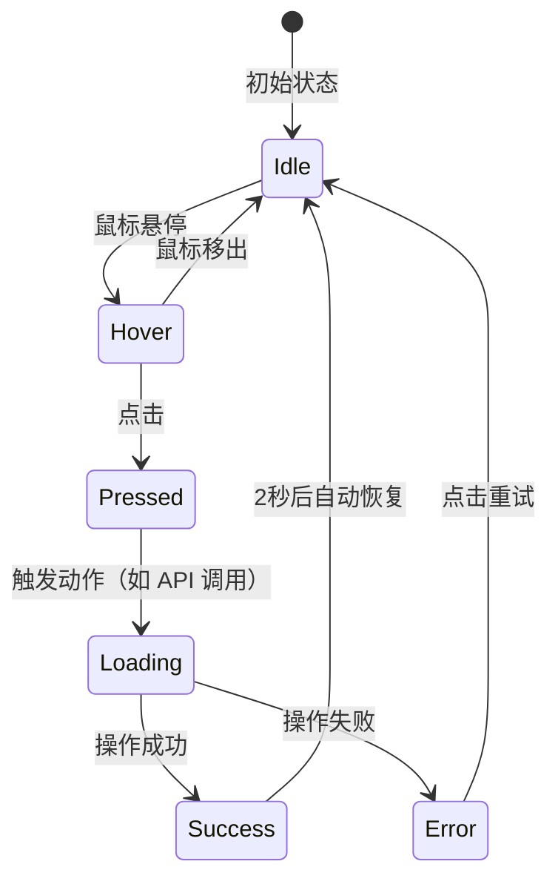

# Skill: mira-b-state

## 所属 Agent
Mira-Builder

## 描述
解析需求中的交互描述（如"点击按钮时放大再恢复"），生成状态机图（Mermaid）与 CSS 动画参数（含 `cubic-bezier`）。

## 输入
- `interaction_description`: 交互描述文本（自然语言）
- `design_tokens`: 设计令牌（来自 `mira-d-token`）

## 输出格式

### 1. 状态机图（Mermaid）


### 2. 动画参数表
| 状态转换 | 动画属性 | 持续时间 | 缓动函数（Easing） | 备注 |
| :--- | :--- | :--- | :--- | :--- |
| Idle → Hover | transform: scale(1.05) | 200ms | ease-out | 按钮微微放大 |
| Hover → Pressed | transform: scale(0.95) | 100ms | ease-in | 按压反馈 |
| Pressed → Loading | opacity: 0.7 | 150ms | ease | 加载态半透明 |
| Loading → Success | background-color 闪绿 | 300ms | cubic-bezier(0.34, 1.56, 0.64, 1) | 弹性回弹效果 |
| Success → Idle | transform: scale(1) | 200ms | ease-out | 恢复正常 |

### 3. CSS 动画代码（供 mira-b-ui 使用）
```css
/* 按钮弹射动画 */
@keyframes bounce-pop {
  0% { transform: scale(1); }
  30% { transform: scale(1.5); }
  60% { transform: scale(0.9); }
  100% { transform: scale(1); }
}

.btn-add {
  transition: transform 200ms ease-out, opacity 150ms ease;
}
.btn-add:hover { transform: scale(1.05); }
.btn-add:active { transform: scale(0.95); }
.btn-add.loading { opacity: 0.7; pointer-events: none; }
.btn-add.success { animation: bounce-pop 600ms cubic-bezier(0.34, 1.56, 0.64, 1); }
```

## 约束
- 缓动函数须优先匹配设计令牌中的 motion 定义。
- 若交互描述包含具体数值（如"放大 1.5 倍"），直接使用该数值，否则使用默认值。
